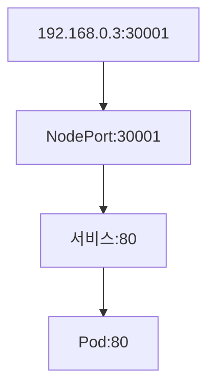
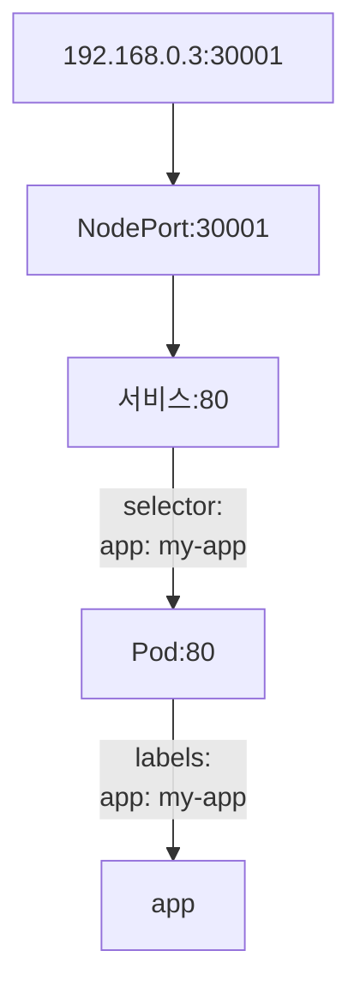

- Kubenetes 객체가 사용하기 위한 데이터를 저장하기 위한 객체
- 환경변수 와 같은 데이터는 대부분 실행 중에는 변하지 않고 실행하기 직전에 변할 수 있는 문자열이나 외부로 노출되어서는 안되는 데이터
- ConfigMap 이나 Secrets 은 스스로 어떤 기능을 하지는 않고 적은 양의 데이터를 저장하는 것이 목적

### ConfigMap
- 문자열 상수를 이용해서 만들 수 있고 파일의 내용을 읽어서 만들 수 있음
- 생성형식
  - `kubectl create configmap <map-name> <data-source> <arguments>`
- 문자열 상수(리터럴)를 가지고 생성
  - `kubectl create configmap [map name] --from-literal=[키]=[값]`
```bash
kubectl create configmap my-config --from-literal=JAVA_HOME=/usr/java

kubectl delete configmap my-config

kubectl create configmap my-config --from-literal=JAVA_HOME=/usr/java --from-literal=URL=http://localhost:8000

kubectl get configmap my-config

kubectl describe configmap my-config
```
- 파일에서 읽어서 만들기
  - 데이터를 저장하는 yaml 파일 생성하고 작성
  ```bash
  echo Hello Config >> configmap_test.html

  kubectl create configmap configmap-file --from-file configmap_test.html
  ```
- 다른 yaml 파일에서 가져다 사용할 때는 최상단에 작성
```yml
envFrom:
    - configMapRef:
      name: ConfigMap 이름
```
- 이제부터 ConfigMap 이름에 해당하는 데이터를 사용할 때 key만 입력하면 됨

### secret 만들기
- kubectl create secret generic 시크릿이름 --from-literal=키=값...

## Volume
- 볼륨은 데이터를 보관하는 장소
- 데이터를 저장소에 저장해두는 애플리케이션을 stateful 이라고 하고 데이터를 저장소에 저장하지 않는 애플리케이션을 stateless 라고 합니다.
- stateless 애플리케이션은 Deployment 나 ReplicaSet 또는 Pod 만 배포하면 되지만 Stateful 애플리케이션은 대부분 영구 저장소를 별도로 만들어야 하기 때문에 stateless 애플리케이션보다 구성이 복잡
- 파드 내에 만들어진 데이터는 파드가 종료되면 소멸되는데 이 때 파드가 종료되더라도 데이터를 보관하기 위한 개념이 볼륨
- 데이터 보관 방법
  - 파드 내에 위치: 파드 내에 데이터를 저장하면 파드가 종료될 때 데이터도 함께 사라짐, emptyDir 볼륨
  - 워커 노드 내에 위치: 파드가 종료되어도 데이터가 유지되지만 노드가 종료되면 데이터도 함께 소멸, hostPath 볼륨
  - 노드 외부에 위치: 파드 혹은 노드 와 무관하게 데이터가 유지

### emptyDir
- 파드 내에 위치
- 파드가 생성될 때 같이 생성되고 파드가 삭제될 때 같이 삭제되는 임시 볼륨
- spec에서 volumes 속성을 이용하고 하위 속성으로 emptyDir 속성에 {}를 설정하면 되고 이를 containers 속성의 volumeMounts 속성의 mountPath에 연결해주면 됩니다.
- 실습
  - 볼륨 마운트를 위한 yaml 파일을 생성: 이미지는 nginx를 이용
```yml {filename="emptydir"}
apiVersion: v1
kind: Pod
metadata:
  name: emptydata

spec:
  containers:
  - name: nginx
    image: nginx
    volumeMounts:
    - name: shared-storage
      mountPath: /data/shared
  
  volumes:
  - name: shared-storage
    emptyDir: {}
```
  - pod 생성 및 확인
  ```bash
  kubectl apply -f emptydir.yml

  # 접속
  kubectl exec -it emptydata -- /bin/sh
  
  # 확인
  cd /data/shared
  ```

### hostPath
- 노드의 로컬 디스크를 파드에 마운트해서 사용하는 로컬 볼륨
- 같은 hostPath를 사용하는 다수의 파드끼리 데이터를 공유해 사용할 수 있다는 장점이 있음
- 파드가 삭제되더라도 hostPath에 있는 파일들은 삭제되지 않고 남아 있으므로 같은 hostPath를 사용하는 다른 파드는 해당 볼륨에 접근해서 파일을 사용할 수 있음
- 실습
  - hostpath를 이용하는 Pod 생성을 위한 yaml 파일을 작성: hostpath.yml
```yml {filename="hostpath.yml"}
apiVersion: v1
kind: Pod
metadata:
  name: hostpath
spec:
  containers:
  - name: nginx
    image: nginx
    volumeMounts:
    - name: localpath
      mountPath: /data/shared

  volumes:
  - name: localpath
    hostPath:
      path: /tmp
      type: Directory
```

```
# 파드 생성
kubectl apply -f hostpath.yml

# 파드 내부로 접속
kubectl exec -it hostpath -- /bin/bash

# 볼륨과 연결된 디렉토리로 이동
cd /data/shared

# 파일을 생성
echo Hello "LocalVOLUME" > test.txt

# 파일 확인
ls -al

# pod를 지우고 다시 만든 후 디렉토리를 확인하면 이전에 만들었던 test.txt 가 존재
# 이 방식도 node 가 삭제되면 데이터는 보존되지 않습니다.
```
### 영구 볼륨 과 영구 볼륨 클레임
- 필요성
  - 임시 볼륨이나 로컬 볼륨은 파드나 노드가 종료되면 데이터가 삭제
  - 데이터를 반 영구적으로 저장을 하고자 할 때는 파드나 노드 내부가 아니라 외부에 저장을 해야 함
- 영구 볼륨(Persistent Volume, PV)
  - 컨테이너, 파드, 노드의 종료와 무관하게 데이터를 영구적으로 보관할 수 있는 볼륨
  - 영구 볼륨은 시스템 관리자가 외부 저장소에서 볼륨을 생성한 후 쿠버네티스 클러스터에 연결하는 것
  - 개발자가 디플로이먼트로 파드를 생성할 때 볼륨을 정의하는데 이 때 볼륨 자체를 정의하는 것이 아니라 볼륨을 요청하는 볼륨 클레임을 지정하고 그 다음 볼륨 클레임에서 볼륨을 할당
  - 영구 볼륨을 요청하는 볼륨 클레임을 영구 볼륨 클레임(Persistent Volume Claim, PVC)이라고 함
  - 개발자가 요청한 영구 볼륨은 API Server에게 보내지고 API Server를 통해서 영구 볼륨이 할당되는 구조임
- 영구 볼륨 실습
  - 영구 볼륨(kind가 PersistentVolume)을 정의: pv.yml
```yml {filename="pv.yml"}
apiVersion: v1

kind: PersistentVolume

metadata:
  name: mysql-pv-volume
  labels:
    type: local

spec:
  storageClassName: manual
  capacity:
    storage: 20Gi
  accessModes:
    - ReadWriteOnce # 노드의 접근 방법으로 ReadWriteOnce이면 하나의 노드에서 읽기쓰기, ReadOnlyMany이면 여러 노드에서 읽기 전용으로 사용하고 ReadWriteMany는 여러 노드에서 읽고 쓰기가 가능하고 ReadWriteOncePod는 하나의 파드에서만 읽고 쓰기가 가능
  hostPath:
    path: "mnt/data"
# 위에 ReclaimPolicy를 설정할 수 있는데 영구 볼륨 클레임이 삭제되었을 때 영구 볼륨을 어떻게 할 것인지 여부를 설정하는 것인데 retain을 설정하면 클레임이 삭제되도 영구 볼륨은 보존되고 delete를 설정하면 같이 삭제되고 recycle은 다른 노드에서 사용 가능한 상태로 설정

# 지금은 노드가 1개라서 hostPath를 설정했지만 nfs 서버를 이용한다면 path 속성에 디렉토리를 설정하고 server에 nfs 서버의 ip를 설정
```
  - pv.yml을 실행시켜서 영구 볼륨을 생성
  ```
  kubectl apply -f pv.yml
  ```
  - Persistent Volume Claim을 위한 yaml 파일 생성: pvc.yml
  ```yml {filename="pvc.yml"}
  apiVersion: v1

  kind: PersistentVolumeClaim

  metadata:
    name: mysql-pv-claim
  
  spec:
    storageClassName: manual # 영구 볼륨의 스토리지이름을 기재
    accessModes:
      - ReadWriteOnce
    resources:
      requests:
        storage: 20Gi
  ```
  - pvc를 생성
  ```bash
  kubectl apply -f pvc.yml
  ```
  - 영구 볼륨 클레임을 사용하는 Pod 생성을 위한 Deployment를 생성: pvc-deployment.yml
```yml {filename="pvc-deployment.yml"}
apiVersion: apps/v1

kind: Deployment

metadata:
  name: mysql

spec:
  selector:
    matchLabels:
      app: mysql
  strategy:
    type: Recreate
  template:
    metadata:
      labels:
        app: mysql
    spec:
      containers:
      - image: mysql:8.0.29
        name: mysql
        env:
        - name: MYSQL_ROOT_PASSWORD
          value: password
        ports:
        - containerPort: 3306
          name: mysql
        volumeMounts:
        - name: mysql-persistent-storage
          mountPath: var/mysql
      volumes:
      - name: mysql-persistent-storage
        persistentVolumeClaim:
          claimName: mysql-pv-claim
```
  - pod 배포
  ```
  kubectl apply -f pvc-deploment.yml
  ```
```
외부 스토리지(NFS, AWS EBS)<-->영구 볼륨(PV)<-ClassName->영구 볼륨 클레임(PVC)<-->API 서버(K8S)<-->Pod(DB)
```
## 파드를 외부로 노출
- 파드는 동적으로 생성(파드의 IP는 고정이 아니고 유동)
IP가 유동이 되면 외부에서 접근하기가 어려움
- 파드를 외부에서 접근할 수 있도록 해주는 것이 서비스
서비스를 사용하면 파드가 클러스터 내 어디에 있든지 마치 고정된 IP로 접근할 수 있도록 해줌

### 서비스 타입
- 클러스터 내부 접속 용도: ClusterIP
- 클러스터 외부 접속 용도: NodePort, LoadBalancer, Ingress, ExternalName
- ExternalName은 외부와 내부 통신이 가능하도록 하기는 하지만 실제로는 내부에서 외부를 접근할 때 사용하는 용도

### ClusterIP
- 기본 서비스 타입
- 서비스를 파드에 연결해 놓으면 서비스IP를 이용해서 파드에 접근
- 서비스에서 사용할 pod를 생성할 Deployment를 생성
  - nginx 이미지를 이용하고 nginx는 80번 포트 사용하며 2개를 생성
  - ClusterIP.yml 파일을 생성하고 작성
```yml {filename="CluserIP.yml"}
apiVersion: apps/v1 # pod create: apps/v1, job create: batch/v1, etc: v1

kind: Deployment

metadata:
  name: clusterip-nginx

spec:
  selector:
    matchLabels:
      run: clusterip-nginx
  replicas: 2

  template: # 컨테이너 생성
    metadata:
      labels:
        run: clusterip-nginx
    spec:
      containers:
      - name: clusterip-nginx
        image: nginx
        ports:
        - containerPort: 80
```
- 파드생성 `kubectl apply -f ClusterIP.yml`
- 파드 확인
```
kubectl get pods

kubectl get pods -o wide

#특정 레이블을 가진 파드를 확인
kubectl get pod -l 레이블앞부분=레이블뒷부분 -o wide

kubectl get pod -l run=clusterip-nginx -o wide
```
- 동일한 노드에 속하는 파드끼리는 기본적으로 이름이나 IP를 이용해서 통신이 가능하지만 파드의 이름과 IP는 동적으로 변경됨
- 서비스를 만드는 방법
  - 메니페스트를 이용해서 생성하는 방법
  - `kubectl expose` 명령어를 사용하는 방법

- 명령어를 이용해서 서비스를 생성
```
kubectl expose deployment/clusterip-nginx
```
- 서비스 정보 확인
```
kubectl get svc

kubectl describe svc 서비스이름
```
- Cluster IP 와 EndPoint 가 출력되는데 Cluster IP는 다른 파드가 접근하기 위한 IP이고 EndPoint 실제 Pod의 IP<br>
이들을 매핑하는 방법은 Service의 spec.selector 에 파드의 레이블을 기재하면 매핑이 됨<br>
Service를 매니페스트로 만들어서 Deployment 연결을 하고자 하면
```
spec:
 type: ClusterIP
 selector:
  run: clusterip-nginx
 ports:
  - name: 이름
    targetPort: Pod내부 포트
    port: 클러스터에서 사용할 포트
    nodePort: 클러스터 외부에서 사용할 포트(30000 ~ 32767)
```
- 클러스터 내에 다른 Pod를 만들어서 확인
  ```
  kubectl run busybox --rm -it --image=busybox /bin/sh
  ```
  - 만들어진 pod 내의 bash에서 `wget 서비스IP` 를 이용해서 index.html 파일이 다운로드 되는지 확인
- 오브젝트 생성 명령
  - `kubectl run`이나 `expose`: 생성형
  - `kubectl create`: 명령형
  - `kubectl apply`: 선언형
  - 컨테이너가 원하는 대로 동작하는지 확인을 할 때는 생성형을 이용
  -  생성형은 오브젝트 생성 및 변경에 대한 히스토리를 저장하기 때문에 과거의 변경 내역을 확인할 수 없다는 단점이 있음
  - 생성형은 개발 과정에서 많이 사용하며 선언형과 명령은 오브젝트의 버전 관리가 중요할 때 사용
  - 명령형은 하나의 yaml이나 json 파일을 이용해서 오브젝트를 생성해야 하며 생성된 파일을 통해 히스토리를 추적할 수 있음
  - 선언형은 annotation에 정보가 저장되어 자동으로 히스토리를 관리하는 것이 가능하지만 선언형에서는 create 나 replace를 사용하지 못함
  - annotation: 오브젝트에 메타데이터를 할당할 수 있는 주석과 같은 개념
    - 레이블과 같이 키-값 구조를 갖지만 기능 측면에서 차이가 발생
    - 레이블은 셀렉터를 이용해서 검색과 식별을 할 수 있지만 annotation 입력은 가능해도 검색은 안됨
    - 쿠버네티스 클러스터의 API Server가 annotation에 지정된 메타데이터를 참조해 동작하기 때문에 주석보다는 의미가 더 있음
    - annotation에 기재하는 내용: 빌드, 릴리즈, 도커 이미지에 대한 정보, 로깅 정보나 모니터링 정보, 디버깅에 필요한 정보(이름, 버전, 빌드 정보), 관리자 연락처, 사용자 지시 사항
    - 리소스 그룹을 지정해야 할 때는 레이블을 사용하지만 쿠버네티스 외부에서 정보를 사용(helm)할 때는 annotation을 이용
- 서비스를 만들 때 ClusterIP를 별도로 지정하지 않으면 ClusterIP가 없는 서비스가 만들어지는데 이런 서비스를 Headless Service라고 하는데 Headless Service를 로드밸런싱이나 서비스IP가 필요 없을 때 생성
- headless service에 selector를 설정하면 API를 통해서 접근할 수 있는 End Point가 만들어지지만 selector가 없으면 End Point가 만들어지지 않음

### External Name
- External Name은 클러스터 내부에서 외부의 엔드 포인트에 접속하기 위한 서비스
  - 엔드포인트는 대부분 클러스터 외부에 위치하는 데이터베이스나 애플리케이션API
  - 외부 자원을 사용할 때 직접적인 이름이나 URL 등을 사용하게 되면 이름이나 URL이 변경되면 코드를 수정해야 하는 일이 발생
  - 설정 파일에 이름을 하나 만들어서 그 이름과 실제 URL 또는 IP를 연결시켜 두면 나중에 외부 자원의 위치나 이름이 변경되었을 때 소스 코드를 수정하지 않고 설정 파일의 연결 부분만 수정해서 새로 배포하면 되기 때문에 변경에 유리
- External Name 사용 방법
```yml
apiVersion: v1
kind: Service
metadata:
  name: external-service
spec:
  type: ExternalName
  externalName: myservice.test.com
```
  - external-service 라는 요청을 내부에서 하면 실제로는 myservice.test.com에 요청을 하게 됨
  - FQDN(Fully Qualified Domain Name - 절대 도메인 또는 전체 도메인 네임): myservice.test.com
  - CNAME(별칭): external-service
- 별명을 사용하는 이유는 크게 2가지인데 하나는 줄여쓰기 위해서이고 다른 하나는 외부의 자원의 이름이 변경되었을 때 소스 코드를 수정하지 않고 사용하기 위해서

### NodePort
- 모든 워커 노드에 특정 포트를 열고 여기로 들어오는 모든 요청을 노드포트 서비스로 전달하기 위한 방법
- 노드포트 서비스를 요청을 받으면 해당 요청을 처리할 수 있는 파드로 요청을 전달
- 외부 사용자는 워커노드의 IP에 노드포트를 추가해 접속을 할 수 있음
- 워커 노드의 IP가 192.169.1.3이고 노트포트를 30001이라고 가정하면 192.169.1.3:30001로 접속하면 됨
- 노드포트는 30000 ~ 32767로 제한되어 있음
- yaml 파일에 노드포트 서비스를 하나 만들고 외부에서 어떤 포트로 접속할 지를 지정하는데 파드는 셀렉터로 지정하면 됨
- 노드포트 사용하기
  - 파드를 생성할 deployment를 위한 yaml 파일 생성

