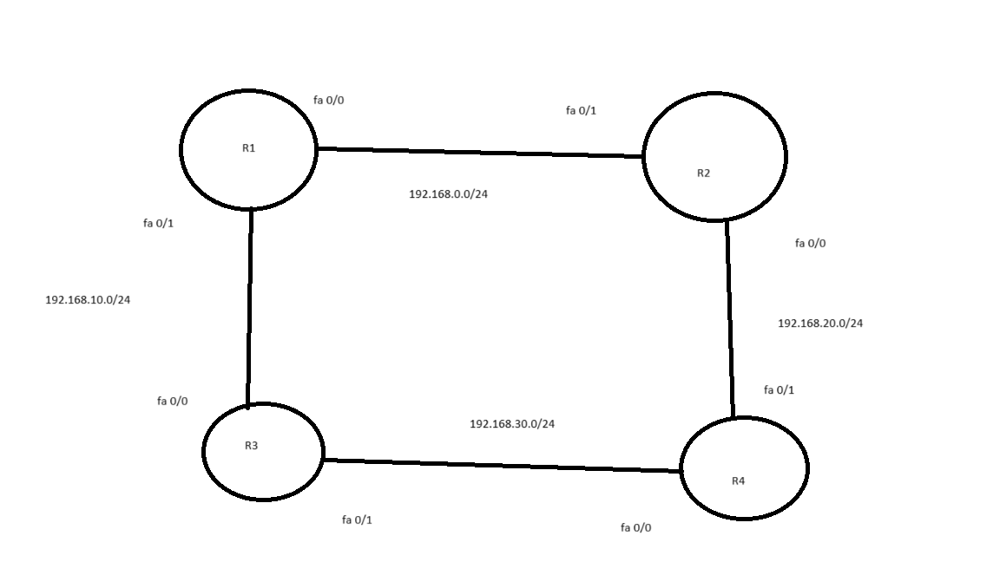

### 라우터 4개를 연결해서 라우팅 프로토콜 실습
- 선 개수만큼 네트워크 대역 필요

- R1(fa0/0)과 R2(fa0/1) 연결
- R1 작업
```
R1#configure terminal
R1(config)#interface fa0/0
R1(config-if)#ip address 192.168.0.1 255.255.255.0
R1(config-if)#no shutdown

R1(config-if)#exit
R1(config)#exit
R1#show ip interface brief
```
- R2
```
R2#configure terminal
R2(config)#interface fa0/1
R2(config-if)#ip address 192.168.0.254 255.255.255.0
R2(config-if)#no shutdown

R2(config-if)#exit
R2(config)#exit
R2#show ip interface brief

R2#show cdp neighbors
명령을 수행해서 2개의 라우터가 연결되었는지 확인

R2#ping 192.168.0.1
정상적으로 응답이 와야 함
```
- R1(fa0/1)과 R3(fa0/0 연결) 작업
```
R1#configure terminal
R1(config)#interface fa0/1
R1(config-if)#ip address 192.168.10.1 255.255.255.0
R1(config-if)#no shutdown

R1(config-if)#exit
R1(config)#exit
R1#show ip interface brief
```
- R3
```
R3#configure terminal
R3(config)#interface fa0/0
R3(config-if)#ip address 192.168.10.254 255.255.255.0
R3(config-if)#no shutdown

R3(config-if)#exit
R3(config)#exit
R3#show ip interface brief

R3#show cdp neighbors
명령을 수행해서 2개의 라우터가 연결되었는지 확인

R3#ping 192.168.10.1
정상적으로 응답이 와야 함
```
- R2(fa0/0)과 R4(fa0/1 연결) 작업
```
R2#configure terminal
R2(config)#interface fa0/0
R2(config-if)#ip address 192.168.20.1 255.255.255.0
R2(config-if)#no shutdown

R2(config-if)#exit
R2(config)#exit
R2#show ip interface brief
```
- R4
```
R4#configure terminal
R4(config)#interface fa0/1
R4(config-if)#ip address 192.168.20.254 255.255.255.0
R4(config-if)#no shutdown

R4(config-if)#exit
R4(config)#exit
R4#show ip interface brief

R4#show cdp neighbors
명령을 수행해서 2개의 라우터가 연결되었는지 확인

R4#ping 192.168.20.1
정상적으로 응답이 와야 함
```
- R3(fa0/1)과 R4(fa0/0 연결) 작업
```
R3#configure terminal
R3(config)#interface fa0/1
R3(config-if)#ip address 192.168.30.1 255.255.255.0
R3(config-if)#no shutdown

R3(config-if)#exit
R3(config)#exit
R3#show ip interface brief
```
- R4
```
R4#configure terminal
R4(config)#interface fa0/0
R4(config-if)#ip address 192.168.30.254 255.255.255.0
R4(config-if)#no shutdown

R4(config-if)#exit
R4(config)#exit
R4#show ip interface brief

R4#show cdp neighbors
명령을 수행해서 2개의 라우터가 연결되었는지 확인

R4#ping 192.168.30.1
정상적으로 응답이 와야 함
```
- 라우터를 케이블을 이용해서 연결하고 IP주소를 설정하면 케이블로 직접 연결되고 동일한 네트워크 대역에 속하면 통신이 가능
  - 현재 R1에서는 R2의 한 쪽 인터페이스와 그리고 R3의 한 쪽 인터페이스까지는 통신이 가능
  - 자신과 직접 연결되어 있지 않거나 네트워크 대역이 다르면 현재는 통신이 되지 않음
  - 통신을 할려면 직접 연결되어 있거나 라우팅 테이블에 찾아 갈 수 있는 방법이 존재해야 함
- static routing을 설정
  - R1에서 R2의 반대편 인터페이스에 연결 설정
  - R1라우터에서 설정
```
R1#configure terminal
Enter configuration commands, one per line.  End with CNTL/Z.
R1(config)#ip route 192.168.20.0 255.255.255.0 192.168.0.254
R1(config)#exit
R1#ping 192.168.20.1
```
```
R1#configure terminal
Enter configuration commands, one per line.  End with CNTL/Z.
R1(config)#no ip route 192.168.20.0 255.255.255.0 192.168.0.254
R1(config)#ip route 0.0.0.0 0.0.0.0 192.168.0.254
R1(config)#exit
R1#show ip route
R1#ping 192.168.20.1
```
- static route의 문제
  - 경로가 존재함에도 불구하고 static route가 설정된 경로 중 일부에 장애가 발생하면 통신이 불가능해짐
  - R2에서 의도적으로 문제 발생
```
R2#configure terminal
Enter configuration commands, one per line.  End with CNTL/Z.
R2(config)#interface fa0/1
R2(config-if)#shutdown
R2(config-if)#exit
```
- R1에서 ping 보내면 가지 않음 
```R1#ping 192.168.20.1```
- 데이터센터
- 두개의 각기 다른 대역폭으로 다른회사회선 사용
  - 예: KT1Mbps, SKT 100Mbps
  - SKT를 메인으로, KT를 백업 회선으로
- 동적라우팅을 수행
  - R1에서 작업
```
R1#configure terminal
Enter configuration commands, one per line.  End with CNTL/Z.
R1(config)#router rip
R1(config-router)#version 2
R1(config-router)#network 192.168.0.0
R1(config-router)#network 192.168.10.0
```
  - R2에서 작업
```
R1#configure terminal
Enter configuration commands, one per line.  End with CNTL/Z.
R2(config)#router rip
R2(config-router)#version 2
R2(config-router)#network 192.168.0.0
R2(config-router)#network 192.168.20.0
R2(config-router)#exit
R2(config)#interface fa0/1
R2(config)#no shutdown
```
  - R3에서 작업
```
R1#configure terminal
Enter configuration commands, one per line.  End with CNTL/Z.
R3(config)#router rip
R3(config-router)#version 2
R3(config-router)#network 192.168.10.0
R3(config-router)#network 192.168.30.0
```
  - R4에서 작업
```
R4#configure terminal
Enter configuration commands, one per line.  End with CNTL/Z.
R4(config)#router rip
R4(config-router)#version 2
R4(config-router)#network 192.168.20.0
R4(config-router)#network 192.168.30.0
```
- R1에서 확인
```
R1#show ip route : 다른 네트워크 대역을 인지하는지 확인
R1#ping 192.168.30.1
R1#ping 192.168.30.254
R1#ping 192.168.20.1
R1#ping 192.168.20.254
```
- R2, R3, R4에서 확인
- R1에서 R4의 192.168.30.254까지 가는 경로 확인
`R1#traceroute 192.168.30.254`
- 경로를 확인해서 첫 번째 경유지의 IP에 해당하는 인터페이스 찾기
- 첫번째 경유지가 192.168.10.254인데 이 인터페이스의 R3이 fa0/0
- R3에서 인터페이스를 shutdown
```
R3#configure terminal
Enter configuration commands, one per line.  End with CNTL/Z.
R3(config)#interface fa0/0
R3(config-if)#shutdown
```
- R1에서 바로 수행
```
R1#ping 192.168.30.254
데이터를 전송받지 못함
R1#show ip route
10번 대역 네트워크가 다운되었다고 메시지 출력
```
- 일정 시간 지난 후에 R1에서 수행
```
R1#ping 192.168.30.254
데이터를 전송받음

R1#show ip route
30번 대역 네트워크가 다른 경로로 도달할 수 있다고 메시지가 출력됨

R1#traceroute 192.168.30.254
데이터를 전송받음
```
- rip 해제
```
R1#configure terminal
R1(config)#no router rip
R1(config)exit
```